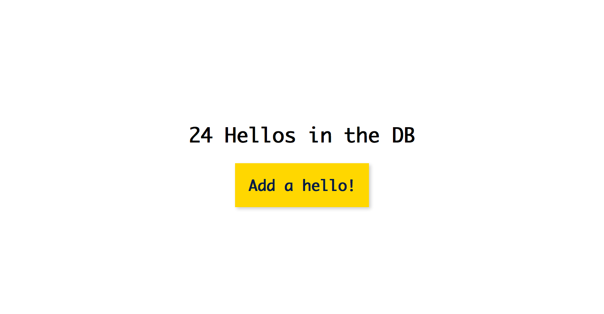

# A `very-basic-express-auth-example` Example
> This is an example of setting up a basic "challenge auth" with express-basic-auth

## Demos

### With NeDB
> To see this example using NeDB, check out this link
- → [Example Using NeDb](https://github.com/joeyklee/very-basic-express-auth-example/tree/with-nedb)

### With Mongodb
> To see this example using mongodb, check out this link
- → [Example Using mongodb](https://github.com/joeyklee/very-basic-express-auth-example/tree/with-mongodb)





The key features to note are:

## config.js
> this is where your server.js will grab the USERNAME and PASSWORD to approve or deny use of your application. 

The USERNAME and PASSWORD will be defined either using the `.env` file:

```txt
USERNAME=joey
PASSWORD=secret
```

OR by doing the following:

```txt
USERNAME=joey PASSWORD=secret npm start
```

## index.js
> You can find the usual express routes and api endpoints, except now we add the `challengeAuth` middleware at each of our routes. What this does is that before any of requests -- GET, POST in this case -- the server checks to see if the client has authenticated or not. If the client has not authenticated, then a menu will appear to add in a basic username and password authentication. The username and password are defined in the step above.


